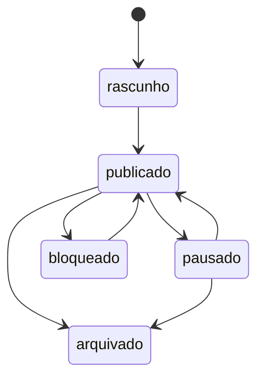
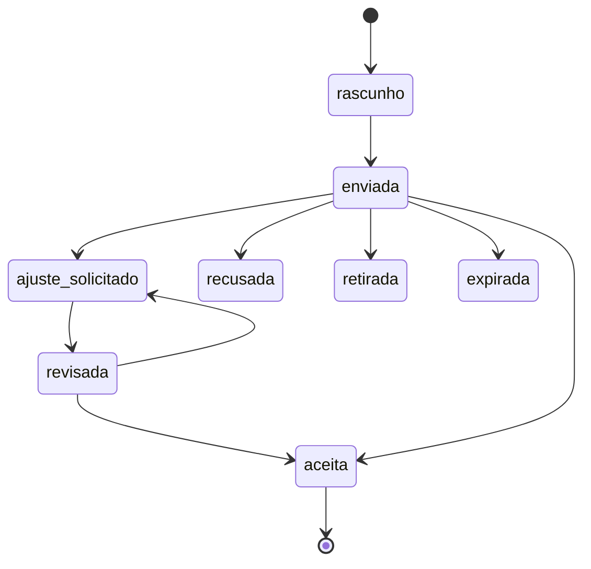
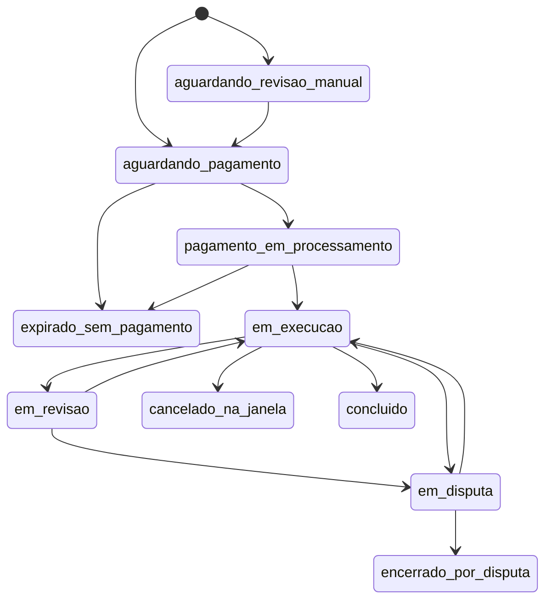
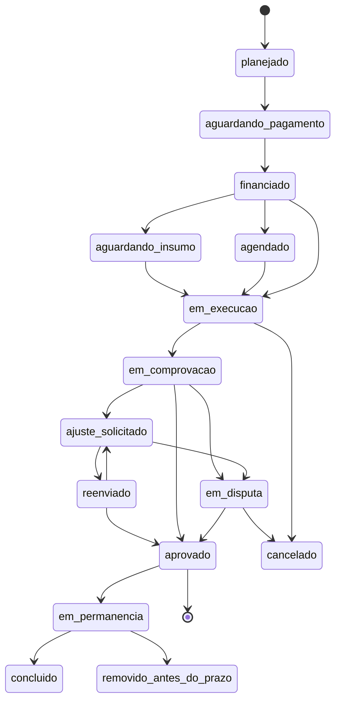

# Máquina de Estados — INFLUENTZ

> **O que é este documento.** A tradução da SPEC em regras de funcionamento: cada coisa que existe no produto (um contrato, um pagamento, uma disputa) só pode estar em uma situação por vez, e só pode ir de uma situação para outra por caminhos permitidos. É o documento que a etapa 3 (telas) e a etapa 4 (modelo de dados) leem para não inventar.
>
> **Versão:** v0.3
> **Base:** `SPEC-INFLUENTZ.md` v0.5 e `DESIGN-SYSTEM.md` v0.4.
>
>
> **Legenda:** 🟢 definido · 🟡 em aberto · 🔵 proposta de Claude além do pedido · 🔴 lacuna encontrada na SPEC · ⚠️ risco ou correção

---

## 0. O que é "máquina de estados", em português simples

Uma máquina de estados é uma lista de **situações possíveis** e das **portas entre elas**.

Exemplo do dia a dia: um pedido de comida está *aguardando confirmação*, depois *em preparo*, depois *saiu para entrega*, depois *entregue*. Ele nunca pula de *aguardando confirmação* direto para *entregue*, e nunca volta de *entregue* para *em preparo*.

Por que isso vem **antes** das telas: cada situação vira uma tela (ou um trecho de tela) e cada porta vira um botão. Se a lista de situações estiver errada, as telas nascem erradas, e o banco de dados nasce errado depois delas. Desenhar tela sem esta lista é desenhar chute bonito.

---

## 1. A decisão de arquitetura mais importante deste documento 🟢

**Não existe uma máquina de estados. Existem oito, e elas são separadas de propósito.**

A tentação natural é fazer uma coisa só: "o contrato". Isso quebra em três lugares concretos deste produto:

1. **O contrato termina antes do dinheiro.** Um contrato pago com cartão fica *concluído* — entrega aprovada, tudo certo — enquanto o dinheiro ainda leva **D+30** para existir (SPEC §4.2). Se fossem a mesma máquina, o sistema precisaria de um estado "concluído mas o dinheiro ainda não chegou", e daí de "concluído, dinheiro chegou, mas o criador ainda não sacou", e assim por diante. Vira um emaranhado.
2. **A contestação de compra chega depois do fim.** A SPEC §4.3 item 4 prevê contestação **após** a liberação. Numa máquina única, um contrato já *concluído* teria que voltar atrás — e voltar atrás é exatamente o que uma máquina de estados existe para proibir.
3. **A regra de ouro contra falência depende dessa separação.** A SPEC §4.2 proíbe adiantar dinheiro que a plataforma ainda não recebeu. A única forma de garantir isso no código é o dinheiro ter estados próprios, ditados pelo Pagar.me, que o contrato não pode alterar.

As oito máquinas:

| # | Máquina | Existe porque |
|---|---|---|
| 0 | **Conta** | Define quem pode fazer o quê (SPEC §9.1, §4.7, §13) |
| 1 | **Anúncio de vitrine** | O "cardápio" do criador (SPEC §3) |
| 2 | **Pedido aberto** | O briefing da marca (SPEC §3) |
| 3 | **Proposta** | A negociação, com campos estruturados (SPEC §3.1) |
| 4 | **Contrato** | O acordo fechado (SPEC §5) |
| 5 | **Marco** | Cada etapa de entrega (SPEC §4.6) |
| 6 | **Dinheiro** (cobrança + repasse) | O relógio é do Pagar.me, não nosso (SPEC §4.2) |
| 7 | **Disputa** | Caminho alternativo mediado (SPEC §12) |
| 8 | **Avaliação** | Double-blind (SPEC §13.1) |

⚠️ **Regra que evita a maior fonte de bug de marketplace:** o **marco** é a fonte da verdade; o **contrato** é um resumo calculado a partir dos marcos dele. Nunca os dois guardando a mesma informação por conta própria — quando duas fontes discordam, alguém recebe errado.

---

## 2. Os tipos de contrato 🟢

A SPEC §3 define dois caminhos de entrada. Cruzando com a estrutura de entrega (§4.6) e a modalidade (§1: remoto, presencial ou híbrido), os tipos reais são:

| Tipo | Entrada | Entrega | Onde muda |
|---|---|---|---|
| **A** | Vitrine (preço fixo) | Única, remota | O caminho mais simples. É o do lançamento. |
| **B** | Pedido aberto | Única, remota | Igual ao A, com proposta antes |
| **C** | Pedido aberto | Em marcos, remota | Cada marco tem vida própria |
| **D** | Vitrine ou pedido aberto | **Presencial ou híbrida** | Estados extras de agendamento e falta |
| **E** | Qualquer um, **intermediado por agência** | Qualquer | Mesmos estados, com autoria registrada |

### 2.1 Tipo F — contrato recorrente 🔵

Reincorporado a pedido do Marco (caso de uso: provador fixo mensal). Detalhado em `FEATURE-MATRIX.md` §3.5.

**A regra de arquitetura que faz isso funcionar sem inventar uma segunda máquina:**

> **Um contrato avulso é uma recorrência de um ciclo só.**

Cada **ciclo** roda a máquina do contrato (§7) inteira, do começo ao fim, de forma independente: é financiado, executado, entregue, aprovado e repassado sozinho. Por cima dos ciclos existe apenas um invólucro leve, a **assinatura**, com sua própria máquina curta:

| Estado da assinatura | Significado |
|---|---|
| `ativa` | Gerando ciclos na periodicidade combinada |
| `pausada` | Não gera ciclo novo; os ciclos já abertos seguem normalmente |
| `encerramento_agendado` | Vale até o fim do ciclo atual, depois para |
| `encerrada` | Não gera mais nada. O histórico de ciclos permanece |

⚠️ **Três regras que impedem o erro clássico de assinatura:**

1. **Ciclo em disputa não contamina os outros.** Março virar disputa não desfaz janeiro nem trava abril. Cada ciclo é uma caixa fechada.
2. **`encerrada` ≠ ciclo `cancelado`.** São ações diferentes, com botões diferentes e consequências diferentes. Quem clica em "cancelar" achando que pula um mês não pode perder o contrato inteiro.
3. **A assinatura nunca cancela um ciclo já financiado.** Dinheiro que já entrou em retenção segue o caminho normal — entrega, aprovação e repasse — mesmo depois de a assinatura ser encerrada.

⚠️ **Não existe tipo para criador menor de idade.** A v0.1 previa um. A pesquisa mostrou que o mecanismo da SPEC §8.3 (assinatura do responsável) é juridicamente insuficiente — falta alvará judicial, que nenhuma plataforma emite. **Criador tem 18 anos completos no v1.** Ver §13.3 e SPEC §8.3.1.

🔵 **Decisão: vitrine é sempre entrega única.** Um item de cardápio ("3 Stories — R$ 300") não comporta etapas. Se a contratação precisa de marcos, ela pertence ao caminho de pedido aberto. Isso mantém o caminho de menor atrito realmente sem atrito, e evita construir duas variações da mesma coisa.

⚠️ **Isto é um tipo, não seis tabelas.** No banco de dados (etapa 4) existe **um** contrato, com um campo `tipo` e um campo `modalidade`. Noventa por cento dos estados são compartilhados. Separar em tabelas diferentes triplicaria o trabalho e os erros.

---

## 3. Máquina 0 — Conta 🟢

Ela existe porque três regras da SPEC dependem de "o que esta pessoa já pode fazer": rede social conectada (§9.1), cadastro fiscal (§4.7) e identidade verificada (§13).

| Estado | O que a pessoa pode fazer |
|---|---|
| `criada` | E-mail confirmado. Navegar, nada mais |
| `perfil_incompleto` | Faltam dados básicos ou comprovação de rede. **Não aparece na busca, não publica, não propõe** |
| `aguardando_verificacao` | Documentos enviados ao Pagar.me. Pode montar perfil, não pode receber |
| `kyc_pendente` | Enviado ao provedor, aguardando análise |
| `kyc_parcialmente_recusado` | 🔴 **Estado que faltava, e é o mais importante dos quatro.** Há inconsistência **e dá para corrigir**. É justamente o estado que precisa de botão |
| `kyc_recusado` | O provedor recusou — documento ilegível, CPF irregular, conta de terceiro. Ver abaixo |
| `kyc_aprovado` | Recebedor criado e validado |
| `verificada` | Tudo liberado |
| `restrita` | Pode ver e concluir o que já está em andamento. **Não inicia contrato novo** |
| `suspensa` | Suspensão temporária (SPEC §13.2 item 4) |
| `banida` | Acesso encerrado |
| `encerrada` | Exclusão pedida pelo titular (LGPD, SPEC §8) |

⚠️ **Borda que só apareceria com o produto no ar:** banir, suspender ou encerrar uma conta **não** encerra os contratos em andamento dela. Existe dinheiro em escrow que precisa ir para algum lugar, e a outra ponta não fez nada de errado. Regra: a conta perde o direito de **iniciar** coisa nova; o que já existe segue até o fim ou até a disputa decidir. Encerramento por LGPD fica pendente até o último contrato fechar — a lei permite reter o mínimo necessário para cumprir obrigação legal e contratual.

⚠️ **Corrigido pelo especialista `financeiro`:** o provedor devolve **quatro** estados (`pending`, `partially_denied`, `denied`, `approved`) e o documento tinha **um**. Colapsar quatro em um recria exatamente o beco sem saída que esta seção diz ter fechado — porque `partially_denied` significa *"dá para corrigir"*, e sem ele a pessoa não recebe o botão que resolve o problema dela.

🔴 **Recusa definitiva precisa de saída.** Se a pessoa não passa na prova de vida ou o CPF é de terceiro, o valor não pode ficar retido para sempre. Após 3 tentativas ou 30 dias, ele **volta à marca por estorno**, o contrato é encerrado **sem culpa do criador**, e o caso fica registrado. ⚠️ A redação vai para o `juridico-br` — devolver à marca um serviço já prestado precisa de cláusula.

⚠️ **`kyc_recusado` é obrigatório, e a falta dele criava um beco sem saída.** Sem esse estado, o criador que entrega, tem a entrega aprovada e é recusado pelo provedor fica com **dinheiro aprovado que não sai, sem saber o motivo e sem nenhum botão**. A saída: o estado carrega o motivo devolvido pelo provedor, oferece reenvio de documento ou troca de conta bancária, e tem prazo. Enquanto isso, o valor permanece retido — nunca se perde.

### 3.1 Submáquina — conexão de rede social 🟢 nova

⚠️ **`rede_declarada` foi eliminado.** Ele materializava a verificação manual por captura de tela, recusada pelo dono do produto. Na INFLUENTZ **não existe métrica que não venha de API** — ver SPEC §9.

Esta submáquina é **uma linha por criador × rede**, não um estado de conta. A mesma pessoa pode ter o Instagram conectado e o TikTok expirado.

| Estado | Significado | Saída |
|---|---|---|
| `nao_conectada` | Nunca conectou | → `conectando` |
| `conta_incompativel` | 🔴 Instagram ou TikTok em conta **pessoal** — não existe API para conta pessoal. A tela mostra o passo a passo de conversão para conta profissional, que é grátis e leva um minuto | → `conectando` |
| `conectando` | Autorização em andamento na rede | → `conectada` / `conexao_falhou` |
| `conexao_falhou` | Usuário negou, faltou permissão, ou a API caiu. **Sempre com motivo legível e botão de tentar de novo** | → `conectando` |
| `conectada_piloto` | Conectada via convite de tester (Instagram) ou sandbox (TikTok) na coorte de lançamento. **O dado é de API, é real.** Marcação interna — não muda nada na tela do usuário | → `conectada` quando o App Review sair |
| `conectada` | Advanced Access / produção | → `token_expirado`, `revogada` |
| `token_expirado` | O token do Instagram morre com 60 dias sem uso. **A métrica congela com a data visível — nunca vira zero, nunca vira branco** | → `conectando` |
| `revogada` | O criador tirou o acesso dentro da rede | → `conectando` |

⚠️ **A transição `conectada_piloto` → `conectada` não pede nada do criador.** O token dele continua válido; só muda o modo do app. Isso precisa estar previsto na modelagem de dados desde já.

⚠️ **`perfil_incompleto` nunca fica sem saída.** Sempre carrega o botão de conectar e, se for conta pessoal, o passo a passo de conversão.

⚠️ **Rede social desconectada no meio do contrato** (a pessoa revoga o acesso no Instagram): o contrato **não** para. O que acontece é o anúncio de vitrine sair do ar. Misturar as duas coisas puniria a ponta errada.

---

## 4. Máquina 1 — Anúncio de vitrine 🟢

| Estado | Significado |
|---|---|
| `rascunho` | Sendo montado |
| `publicado` | Visível na busca, contratável |
| `pausado` | Criador sem agenda. Some da busca, não é excluído |
| `bloqueado` | Trust & Safety ou categoria proibida (SPEC §8.3) |
| `arquivado` | Aposentado. Some da vitrine, **contratos passados continuam existindo** |

⚠️ **Regra que evita disputa:** o anúncio é um **modelo**, não o contrato. No momento da contratação, preço, prazo e todos os termos são **congelados** dentro do contrato. Se o criador subir o preço amanhã, os contratos em andamento não mudam. Sem essa regra, o preço combinado muda sozinho — e isso é indefensável numa contestação.

---

## 5. Máquina 2 — Pedido aberto 🟢

| Estado | Significado |
|---|---|
| `rascunho` | Briefing sendo escrito |
| `aberto` | Recebendo propostas |
| `em_selecao` | Prazo de propostas fechado, marca avaliando |
| `encerrado_com_contrato` | Gerou pelo menos um contrato |
| `encerrado_sem_contrato` | Marca não escolheu ninguém |
| `expirado` | Prazo venceu sem seleção |
| `cancelado` | Marca desistiu |
| `bloqueado` | Categoria proibida (SPEC §8.3) |

### 5.1 Um pedido gera vários contratos 🟢

**Sim, já no v1. Sem tela de campanha dedicada.**

Uma campanha real contrata 3, 5, 10 criadores do mesmo briefing. A marca seleciona quantas propostas quiser, e **cada seleção cria um contrato independente** — com seu próprio escrow, seus próprios marcos, sua própria disputa.

⚠️ **Isto reverte a recomendação anterior deste documento**, que sugeria adiar. O motivo da reversão é uma contradição com a SPEC §2: agências entram no v1 justamente porque hoje sofrem com gestão manual. **A agência rodando uma campanha com vários criadores é o caso de uso que faz a agência existir no produto.** Adiar multi-contrato esvaziaria a razão pela qual as agências foram incluídas.

**O que entra no v1 e o que não entra:**

| Entra | Fica para depois |
|---|---|
| Um pedido → vários contratos | Painel de campanha com números agregados |
| A página do pedido lista os contratos que ele gerou, com o estado de cada um | Orçamento consolidado e alerta de estouro |
| Selecionar mais de uma proposta | Ação em lote (aprovar 5 entregas de uma vez) |

*Por que o custo é baixo:* a parte cara de "campanha" é a visão agregada, não a relação um-para-muitos. A lista de contratos cabe numa página que já existe — a do próprio pedido. O banco de dados já nasce com a relação certa, então a tela de campanha entra depois sem refazer nada.

---

## 6. Máquina 3 — Proposta 🟢

É onde a negociação acontece. A SPEC §10 fecha o chat antes do contrato pago — então **é aqui, em campos estruturados, que as duas partes conversam.**

| Estado | Significado |
|---|---|
| `rascunho` | Sendo montada |
| `enviada` | Aguardando a outra ponta |
| `ajuste_solicitado` | A outra ponta pediu mudança em campo específico |
| `revisada` | Reenviada com a mudança |
| `aceita` | **Aceite bilateral. Congela os termos e cria o contrato** |
| `recusada` / `retirada` / `expirada` | Fim do caminho |

### 6.1 🔴 Lacuna encontrada: o criador precisa poder recusar uma contratação de vitrine

A SPEC §3 diz que na vitrine "a marca contrata direto, sem negociar". Lido ao pé da letra, isso obriga o criador a aceitar qualquer contratação automaticamente. Isso não funciona:

- O criador pode estar sem agenda naquela data.
- O criador pode não querer divulgar aquela marca — inclusive porque ela concorre com um cliente atual dele. Obrigá-lo cria um problema contratual do criador com terceiros.
- Um criador forçado entrega mal, e a disputa cai no colo da INFLUENTZ.

🔵 **Correção proposta:** mesmo na vitrine existe um **aceite do criador**, com janela curta (proposta: **48 horas**). Sem resposta, a contratação expira sozinha e a marca não perde nada. A vitrine continua sendo "sem negociar" — o que não existe ali é discussão de preço e escopo, não o direito de recusa. Quarenta e oito horas é a janela que o Fiverr usa para a outra ponta responder a um pedido de cancelamento antes de decidir sozinho.

### 6.2 🔵 O aceite vem antes do pagamento — e por quê

A SPEC §5 já coloca o aceite (passo 3) antes do pagamento (passo 4). Está certo, e agora tem uma razão técnica registrada:

**Pix e boleto não têm o "cancela a reserva" do cartão.** No cartão existe autorização e captura em dois tempos: reserva-se o valor e cobra-se depois; se der errado, a reserva cai e, na prática, nada aconteceu para o portador. Pix não funciona assim — ele é liquidação **imediata** entre contas, então o dinheiro já entrou de fato e desfazer significa **fazer uma transferência de volta**. Boleto é ainda mais rígido: devolver exige transferência nova e dados bancários do pagador.

Ou seja: dois dos três meios aceitos (§4.2) não suportam "cobra agora, devolve se der errado" sem gerar uma operação de estorno de verdade, com custo, prazo e atrito.

Consequência: cobrar antes do aceite do criador produziria estorno de Pix e boleto como rotina na vitrine — justamente no caminho que deveria ser o de menor atrito. **Cobra-se depois do aceite.**

---

## 7. Máquina 4 — Contrato 🟢

| Estado | Significado | Cor (DESIGN-SYSTEM §3.4) |
|---|---|---|
| `aguardando_revisao_manual` | Mesmo CPF/CNPJ nas duas pontas (SPEC §2) ou valor acima do limite (§13) | Atenção |
| `aguardando_pagamento` | Aceito, cobrança emitida, prazo correndo | Atenção |
| `pagamento_em_processamento` | Boleto emitido ou Pix pendente (§4.2: boleto leva 1 a 2 dias) | Atenção |
| `em_execucao` | Dinheiro em escrow, trabalho acontecendo | Info |
| `em_revisao` | Entrega submetida, marca avaliando (§12.1) | Atenção |
| `em_disputa` | Mediação aberta (§12.2) | Crítico |
| `concluido` | Todos os marcos aprovados | Sucesso |
| `cancelado_na_janela` | Cancelamento com reembolso total (§8.1) | Neutro |
| `encerrado_por_disputa` | Trust & Safety decidiu | Neutro |
| `expirado_sem_pagamento` | Marca não pagou no prazo | Neutro |

### 7.1 🔴 Lacuna: a janela de 24 horas da SPEC §8.1 conta a partir de quando?

A SPEC §8.1 dá reembolso total "até 24h após o aceite". Com boleto, a confirmação do pagamento leva **1 a 2 dias** (§4.2). A janela de arrependimento venceria **antes de o dinheiro chegar** — a marca perderia um direito por causa do meio de pagamento que escolheu.

🔵 **Correção proposta:** a janela de 24 horas conta a partir da **confirmação do pagamento** (entrada em `em_execucao`), não do aceite. Assim ela vale igual para Pix, boleto e cartão.

### 7.2 🔴 Lacuna: a comissão precisa ser congelada no contrato

A SPEC §4.4 tem três faixas de comissão (15%, 8% na recontratação, 7,5% no lançamento). Duas armadilhas:

1. **Se a comissão for calculada na hora do repasse**, um contrato assinado durante os 90 dias de lançamento a 7,5% viraria 15% se o repasse acontecesse depois — em cartão, o repasse é D+30, então isso aconteceria de verdade. A marca e o criador combinaram um número e receberiam outro.
2. **O contador de recontratação precisa contar contratos concluídos, não iniciados.** Se contar iniciados, qualquer um cria dois contratos de R$ 1, cancela, e destrava o desconto de 8% para sempre. É uma porta de fraude aberta.

🔵 **Regras propostas:**
- A alíquota é **congelada no contrato no momento da criação** e nunca recalculada.
- O contador de recontratação conta contratos com estado `concluido` entre aquele par marca–criador.
- Quando lançamento (7,5%) e recontratação (8%) se sobrepõem, **vale a menor**.
- A unidade de contagem das "50 primeiras transações" é o **contrato**, não a cobrança. Um contrato de 5 marcos consome 1 das 50, não 5.

---

⚠️ **`aguardando_revisao_manual` tem quem o empurre e tem saída negativa.** As duas ações — *aprovar* e *recusar com motivo* — vivem na **caixa de entrada do operador**, e existe o estado **`recusado_na_revisao`**, com aviso às duas pontas. Sem isso, o contrato entra no estado e ninguém consegue tirá-lo de lá.

## 8. Máquina 5 — Marco 🟢

É a máquina onde o trabalho realmente acontece. Contrato de entrega única tem **um** marco — a estrutura é a mesma, o que muda é a quantidade.

| Estado | Significado | Cor |
|---|---|---|
| `planejado` | Definido no contrato, ainda não financiado | Neutro |
| `aguardando_pagamento` | Cobrança emitida para este marco | Atenção |
| `financiado` | **Dinheiro retido.** O criador pode começar | Protegido |
| `aguardando_insumo` | A marca ainda não entregou o que o criador precisa para trabalhar — produto físico, acesso, roteiro. **O relógio do criador não corre aqui** | Atenção |
| `agendado` | Data confirmada pelos dois (regime P3 e entregas com data fixa) | Info |
| `em_execucao` | Trabalho em andamento | Info |
| `em_comprovacao` | 🔴 O criador cumpriu **o que o contrato define como prova**. Começa o relógio da aprovação | Atenção |
| `ajuste_solicitado` | Marca pediu revisão referenciada ao briefing (§12.1) | Atenção |
| `reenviado` | Criador reenviou | Atenção |
| `aprovado` | Aprovado pela marca **ou por prazo vencido**. 🔴 **É aqui que o dinheiro é liberado, em todos os regimes** | Sucesso |
| `em_permanencia` | Obrigação **depois** do pagamento: a publicação precisa continuar no ar pelo prazo combinado | Info |
| `removido_antes_do_prazo` | Saiu do ar antes. Entra na caixa de entrada e conta no histórico do criador — **nunca gera estorno automático** | Atenção |
| `concluido` | Permanência cumprida, ou regime que não tem permanência | Sucesso |
| `em_disputa` | Congela tudo | Crítico |
| `cancelado` | Não será entregue | Neutro |

### 8.0.1 Os quatro tipos de trabalho 🟢

**A regra geral:** *o dinheiro é liberado no evento comprovável mais próximo daquilo que a marca comprou* — e esse evento é escrito na tela, em português, **antes de qualquer um aceitar**.

| Tipo de trabalho | Quem publica | O que a marca recebe | O que prova que acabou | Direitos padrão |
|---|---|---|---|---|
| **1. Publicação no perfil do criador** — Reels, TikTok, vídeo no YouTube, post | **criador** | A publicação no ar, no perfil dele | O criador cola o link. A plataforma confere na API que está no ar | Fica no ar **90 dias**. A marca reposta nos canais dela por **12 meses**. Anúncio pago: **não**, salvo se contratado |
| **2. Stories** | **criador** | A sequência no ar | Mesma conferência por API, **enquanto está no ar** | Fica no ar **24 h**. Repost por 12 meses |
| **3. Material entregue para a marca usar** — UGC, foto de produto, vídeo de anúncio, locução, roteiro | **marca** *(ou criador, ou os dois)* | Os arquivos, em alta | Arquivo entregue + aprovação da marca. **Sem resposta em 7 dias, aprova sozinho e o criador recebe** | **12 meses, já incluindo anúncio pago** nas contas da própria marca — é para isso que ela compra |
| **4. Compromisso com hora marcada** — evento, palestra, live, gravação presencial | **ninguém** *(se ele também postar, soma-se a linha 1)* | A presença dele, na data e hora combinadas | Os dois confirmam no app. **Se um não confirmar em 7 dias, vale a confirmação do outro** | A marca usa o registro do evento por **12 meses** |

🔴 **A pergunta que resolve tudo é uma só, e ela está na tela:** *"Quem vai publicar? A marca · O criador · Os dois."* O caso de material entregue em que a marca **também** quer que o criador poste é a **linha 3 com a resposta trocada** — ou as linhas 3 e 1 no mesmo pedido. **Não existe categoria nova.**

**O que não é tipo de trabalho:** anúncio pelo perfil do criador é uma **caixinha** dentro das linhas 1 e 3, não uma quinta linha. Embaixador é a linha 1 repetida todo mês — é contrato recorrente. Afiliado e performance ficam fora do v1, porque valor variável não pode ser financiado antes do início.

**Nenhuma sigla aparece para o usuário.** Ele lê a coluna *"o que prova que acabou"*, em português.

⚠️ **A publicação só é oferecida em rede que o criador já tem conectada** — senão o contrato nasceria prometendo uma prova que a plataforma não consegue produzir.

### 8.0.2 O que o usuário vê antes de aceitar

Um bloco fixo na proposta, **com o mesmo texto para os dois lados**, congelado no contrato:

> **O que libera o pagamento de R$ 1.200**
> ✅ Você publica o Reels no @perfil e cola o link aqui. A INFLUENTZ confere na API do Instagram que o post está no ar. *(P1)*
>
> ✅ Você entrega os 3 vídeos em MP4. A marca tem **7 dias** para aprovar ou pedir ajuste. **Sem resposta dela, é aprovado automaticamente e você recebe.** Quem publica é a marca — não há link para colar. *(P2)*
>
> ✅ Você comparece **dia 14/10, às 19h, na Av. Paulista 1000**. Os dois confirmam a presença no app. **Se a marca não confirmar em 7 dias, vale a sua confirmação.** *(P3)*

Uma frase, valor incluído, e sempre com **quem perde no silêncio** explícito.

⚠️ **Quando o contrato inclui anúncio pago**, entra mais uma linha no mesmo bloco: *"você concede a permissão de parceria no Instagram, ou cola o código do TikTok, com validade de 12 meses."* **É condição de o criador receber, não um pedido informal depois** — senão a marca paga pelo direito e nunca recebe a chave.

### 8.0.3 Permanência — obrigação depois do pagamento, e o padrão varia por tipo

⚠️ **Permanência não retém dinheiro.** Se ela segurasse o repasse, o criador esperaria 90 dias para receber — o oposto da regra travada. Descumprir gera registro, cláusula e direito de disputa da marca; **nunca estorno automático**.

| Tipo | Permanência padrão |
|---|---|
| Feed e Reels | **90 dias** |
| **Stories** | **24 horas** |
| P2, P3 e P4 | não se aplica |

🔴 **Stories com padrão de 90 dias nasceria descumprido**, porque Stories expira em 24 horas. O padrão passa a ser por tipo de entrega, não único.

**Como a permanência é verificada:** a plataforma consulta a API oficial **uma vez por dia nos primeiros 7 dias e uma vez por semana depois**, até fechar o prazo. Remoção precoce quase sempre acontece nos primeiros dias; a que acontece depois é detectada em até uma semana. *(O porquê da cadência é de custo e está em `SPEC-INFLUENTZ.md` §14.2.5.)*

### 8.0.4 Produto físico — três vozes, e a transportadora é a que decide 🔴

**O relógio do criador não corre enquanto o produto está a caminho.** Isso não é gentileza: é o único jeito de o prazo ser justo, porque o atraso dos Correios é da marca, não dele.

⚠️ **Mas só o criador confirmando o recebimento dá a ele o poder de travar o contrato mentindo.** Por isso são três vozes:

| Voz | O que diz | Efeito |
|---|---|---|
| **Marca** | Declara o envio e o **código de rastreio** | Sem código no prazo, é ela que está em falta |
| **Transportadora** | Postado · em trânsito · **entregue** · devolvido · extraviado | 🔴 **É a fonte da verdade sobre a chegada** |
| **Criador** | "Recebi e está conforme" · "Chegou errado ou danificado" (com foto) · "Não chegou" | Confirma **conformidade**, não chegada. A foto vira prova |

**O criador deixa de confirmar *se chegou* e passa a confirmar *se veio certo*.**

🔴 **O relógio começa pelo que vier primeiro, e isso é a correção mais importante desta seção:**

1. o criador confirma; **ou**
2. o rastreio marca "entregue" (mais 24 h); **ou**
3. vence o prazo desde a postagem sem nenhuma contestação registrada.

**A confirmação do criador continua existindo — ela deixa de ser um veto.** Sem isso, um clique mentiroso entrega o produto de graça: o marco trava, o contrato é cancelado com reembolso integral, e o golpista fica com a mercadoria. Repetível com quantas marcas ele quiser.

**Quando as vozes discordam** — rastreio diz entregue e o criador diz que não chegou: o relógio **não** começa, e o caso vai para a caixa de entrada **com o registro da transportadora anexado**. O padrão da decisão é o rastreio, salvo prova em contrário. **Não é automático** — baixa indevida existe, e punir o criador por isso seria punir a ponta errada. Mas a alegação dele agora contradiz um documento de terceiro, em vez de valer sozinha.

| Situação | Prazo | O que acontece |
|---|---|---|
| Marca lança o rastreio | 5 dias úteis após `financiado` | Vencido: aviso. Aos 10 dias úteis: cancelamento com **reembolso integral e sem culpa do criador** |
| Rastreio marca "entregue" | — | O relógio do criador começa 24 h depois, sozinho |
| Sem evento de entrega | 15 dias corridos da postagem | A marca reenvia uma vez, ou cancelamento com reembolso integral |
| Entregue e o criador silencia | 24 h | O relógio corre. **Silêncio não trava mais o contrato** |
| "Chegou errado ou danificado" | imediato | Volta para `aguardando_insumo`, caixa de entrada com a foto, marca reenvia ou cancela |

🔴 **"Não recebi" é alegação registrada, não estado silencioso.** Vai para a caixa de entrada com rastreio, endereço e valor, **e fica no histórico do criador**. Duas alegações de não-recebimento com rastreio marcado como entregue = revisão de conta. **É o registro que mata o golpe repetível — não a apuração do caso isolado.**

⚠️ **Enquanto a alegação estiver aberta, o prazo do criador fica suspenso.** O que corre é a apuração, nunca a penalidade. E a alegação só pesa contra ele **quando o rastreio diz "entregue" e ele diz que não** — criador em área de entrega ruim não pode ser punido por estatística.

**Rastreio é obrigatório quando a proposta marca "requer envio".** Sem código lançado, a marca não avança o marco. ⚠️ **Exceção honesta:** entrega em mãos e motoboy existem — nesse caso o modo é *"entrega sem rastreio"*, com **confirmação bilateral** e foto do produto pelo criador. Quem abre mão da prova assume a regra mais lenta.

**Acima de R$ 1.000 de valor declarado, o envio exige comprovação de entrega** (aviso de recebimento ou entrega com assinatura), paga pela marca. Um produto de R$ 3.000 sem prova de entrega é um convite.

🔴 **A API dos Correios não serve, e isso muda o desenho.** Ela passou a exigir contrato e **só permite consultar objetos do próprio remetente** — a INFLUENTZ não pode rastrear um objeto postado pela marca ([Correios — Desenvolvedores](https://www.correios.com.br/atendimento/developers)). A rota que funciona é agregador de rastreio: o **17TRACK** cobre os Correios e dá **100 consultas gratuitas por mês** ([17TRACK](https://www.17track.net/en/carriers/correios-brazil), [planos](https://help.17track.net/hc/en-us/articles/37575217580825-Plan-Details)). Com cerca de 6 objetos por mês no lançamento, o custo é **zero**. Mesma regra do agregador de métricas: **adaptador próprio, fornecedor trocável.** ⚠️ Preço dos planos pagos e cobertura de transportadoras privadas não confirmados — entram na lista de perguntas de fornecedor.

⚠️ **O que isso quebra para um cliente legítimo:** o criador que viaja e pega o produto na portaria três dias depois vê o relógio já correndo. Saída: um botão de **"recebi hoje, não na data do rastreio"**, que ajusta uma vez e fica registrado.

### 8.1 Financiamento marco a marco 🟢

**Cada marco é financiado antes de o criador começar a trabalhar nele.** Não se cobra o contrato inteiro de uma vez.

Por quê: é o modelo do Upwork, e é exatamente o que a SPEC §4.3 item 1 já exige como prova documental — "o marco ter sido financiado antes do início" é a condição da proteção de pagamento do Upwork. Financiar tudo na frente trava caixa demais da marca; financiar depois da entrega deixa o criador sem garantia nenhuma.

### 8.2 🔴 Lacuna crítica: não existe aprovação automática na SPEC

**O que acontece hoje, pela SPEC, se a marca simplesmente nunca clicar em "aprovar"?** O dinheiro fica preso em escrow para sempre e o criador vira refém de silêncio. Isso não é hipótese remota — é o caso mais comum de suporte em marketplace de serviço.

Toda plataforma consolidada resolve com relógio:
- **Fiverr:** o pedido é concluído automaticamente **3 dias** após a entrega, se o comprador não agir.
- **Upwork:** se o cliente não responde à submissão do marco em **14 dias**, o valor é liberado ao freelancer no 15º dia.

🔵 **Proposta para a INFLUENTZ: 7 dias corridos**, com aviso no 3º e no 6º. Fica no meio dos dois: o trabalho aqui é conteúdo de marca, mais rápido de avaliar que um projeto de software (Upwork) e mais caro que um serviço de R$ 30 (Fiverr).

Regras do relógio:
- Pedir ajuste **pausa** o relógio; ele reinicia do zero quando o criador reenvia.
- Abrir disputa **congela** o relógio até a decisão.
- O prazo é **configurável no painel administrativo**, nunca fixo no código — mesma regra da comissão (SPEC §4.4).

### 8.3 🔴 Lacuna: e se o criador nunca entregar?

O espelho da lacuna anterior, e a SPEC também não cobre.

🔵 **Proposta:** o **prazo de entrega é campo obrigatório e estruturado da proposta** (SPEC §3.1). Vencido o prazo, mais uma tolerância de **3 dias**, a marca ganha dois botões: *cancelar e receber de volta* ou *abrir disputa*. Sem prazo estruturado, não existe vencimento — e sem vencimento, o dinheiro da marca fica preso pelo lado inverso.

### 8.4 Revisões — quem define, quantas, e o que impede o loop infinito 🔴

**São duas revisões incluídas, para todo mundo.** Escolher esse número item por item é uma decisão a mais para o criador e uma informação a mais para a marca comparar — e nenhum dos dois ganha com isso.

| Parâmetro | Regra |
|---|---|
| Quantas | 🟢 **Duas, para todo mundo. Fixo.** Não é campo, não é decisão, não aparece na tela de quem monta a proposta |
| "Ilimitadas" | ❌ Não existe. Não é vantagem comercial: é disputa com hora marcada |
| Onde aparece | Ao lado do preço, como informação: *"2 rodadas de ajuste incluídas"* |
| Negociável? | **Só no pedido aberto**, onde já se negocia. O criador que quer vender revisão extra embute no preço |

*Referência de mercado:* no Fiverr o número é definido pelo vendedor no pacote e revisão extra é vendida à parte; no Upwork o mecanismo equivalente é o aditivo sobre o marco, e a própria plataforma reporta que **41% das disputas vêm de confusão de escopo**.

🔴 **A regra que fecha o botão de nunca pagar.** A versão anterior dizia que pedir ajuste pausa o relógio e ele reinicia do zero a cada reenvio. Sem limite de rodadas, isso é um jeito educado de nunca aprovar.

> **Só as revisões incluídas pausam e reiniciam o relógio. Esgotadas, o relógio corre até o fim e aprova.** A marca continua com três saídas: aprovar, propor aditivo, ou abrir disputa.

### 8.4.1 Ajuste ou mudança de escopo — o critério é mecânico, não é opinião

O critério já existia no produto e ninguém tinha usado: **os campos estruturados congelados no contrato.**

> **Ajuste** = pedido que pode ser cumprido **sem alterar nenhum campo congelado** — formato, duração, quantidade, plataforma, data, local, roteiro já aprovado, menções obrigatórias.
> **Mudança de escopo** = pedido que **só** pode ser cumprido alterando um deles.

**Como se decide, sem depender de quem grita mais:**

1. A marca pede o ajuste **referenciado ao ponto do briefing**.
2. O criador tem um botão **"isso muda o escopo"** — e é obrigado a **apontar qual campo congelado muda**. Sem apontar campo, o botão não envia.
3. Apontado o campo, o pedido vira **aditivo proposto**, com preço e prazo novos. A marca aceita, retira o pedido, ou abre disputa.
4. **O relógio congela enquanto o aditivo está pendente, por até 3 dias** — senão o aditivo vira a nova forma de empurrar.

O criador decide primeiro porque carrega o custo e porque a alegação dele é **verificável contra um campo**, não contra um sentimento. A marca nunca fica sem saída: tem a disputa, e na disputa a prova já está pronta — o campo congelado contra o pedido escrito.

**O efeito esperado com 20 contratos por mês** (premissas declaradas: 15% pedem ajuste, 1 em 4 desses esgota as revisões): sem limite e sem aditivo, 2 a 3 casos abertos por mês, sem prazo, nenhum fechando sozinho. Com a regra, **0,5 a 0,8 disputa por mês**. E o ganho maior não é o número — é que **o caso que sobra já chega com a prova pronta**, então mediar leva minutos.

### 8.5 Tipo D (presencial e híbrido) — estados extras 🔴

A SPEC §1 inclui presença física ("remoto, presencial ou híbrido") e o guia da marca de 2020 já trazia o campo "necessário visita técnica". Mas **todos os estados de entrega da SPEC pressupõem arquivo enviado pelo sistema**, e presença física não é arquivo.

O que muda:

| Ponto | Remoto | Presencial |
|---|---|---|
| Antes de executar | — | Estado `agendado`: data e local confirmados pelos dois |
| O que é "entregue" | Arquivo submetido | **Confirmação de comparecimento** pelas duas partes |
| Falta | Não existe | **Precisa de tratamento próprio dos dois lados** |
| Cancelamento | Tabela da SPEC §8.1 | ⚠️ A tabela §8.1 **não serve** — ver abaixo |

⚠️ **A regra de cancelamento da SPEC §8.1 quebra no presencial.** Ela diz "criador já começou → mediação, liberação proporcional ao trabalho feito". Num evento presencial, o criador **bloqueou uma data**, recusou outros trabalhos e possivelmente comprou passagem. Cancelar 2 dias antes e cancelar 30 dias antes não podem valer a mesma coisa, e "proporcional ao trabalho feito" dá zero — o trabalho ainda não começou, mas o prejuízo já existe. **Escala adotada em §13.2.**

---

## 9. Máquina 6 — Dinheiro 🟢

**São duas máquinas, não uma:** o dinheiro entrando (cobrança) e o dinheiro saindo (repasse). Quem manda nelas é o Pagar.me, via aviso automático (*webhook* — a notificação que o Pagar.me envia ao nosso sistema quando algo muda). Nosso sistema **registra**, não decide.

### 9.1 Cobrança — o dinheiro entrando

| Estado | Significado | Cor |
|---|---|---|
| `criada` | Cobrança gerada | Neutro |
| `aguardando_pagamento` | QR do Pix na tela, boleto emitido, cartão autorizando | Atenção |
| `paga` | Pix na hora; boleto confirmado; cartão capturado | Sucesso |
| `recusada` | Cartão negado | Crítico |
| `expirada` | QR ou boleto venceu | Neutro |
| `estornada` | Devolvida | Neutro |
| `em_contestacao` | Chargeback aberto pelo banco do portador | Crítico |
| `em_defesa` | 🔴 **Estado novo (08/09/2026).** Dossiê montado e enviado. ⚠️ **Prazo de 10 dias, fatal** — é onde mora a contagem regressiva no painel Trust & Safety. Sem este estado, disputa se perde por silêncio | Crítico |
| `contestacao_ganha` / `contestacao_perdida` | Decisão do banco (até 120 dias) | Sucesso / Crítico |

### 9.2 Repasse ao criador — o dinheiro saindo

**Esta é a máquina que protege a INFLUENTZ de quebrar.**

| Estado | Significado | Cor |
|---|---|---|
| `retido` | **Escrow.** Marco financiado, entrega não aprovada | **Protegido** |
| `liberado_aguardando_prazo` | Aprovado, **mas o dinheiro ainda não existe** (cartão D+30) | Atenção |
| `disponivel` | Está no saldo do criador no Pagar.me | Sucesso |
| `sacado` | Foi para a conta bancária do criador | Sucesso |
| `bloqueado_por_pendencia_fiscal` | Acumulado passou de R$ 500 sem MEI/CNPJ (SPEC §4.7) | Atenção |
| `bloqueado_por_disputa` | Congelado até a decisão | Crítico |
| `bloqueado_por_verificacao` | 🔴 Provedor recusou o cadastro do recebedor. **O valor fica retido, nunca se perde** | Atenção |
| `revertido` | Contestação perdida, descontado do saldo | Crítico |
| `chargeback_absorvido` | 🔵 **Estado novo (08/09/2026).** Contestação perdida e a perda foi para o fundo de contestação da plataforma. Fecha o ciclo — antes, `revertido` deixava a pergunta "revertido de quem?" no ar. **O criador não é tocado** | Neutro |
| `debito_pendente_criador` | 🔴 **Substitui o antigo `saldo_negativo`, e é muito mais estreito.** Só entra por **decisão humana registrada** — conluio comprovado ou entrega inexistente — com motivo, autor e data. Bloqueia saque, **não** bloqueia contratar | Crítico |

⚠️ **Mudanças, revisadas pelo especialista `financeiro`:**

- **`reservado_contestacao` foi removido.** Era a materialização da reserva de 90 dias, recusada pelo dono do produto — e a pesquisa mostrou que ela nem protegia: a janela de contestação por "serviço não recebido" conta 120 dias **a partir da data prevista de entrega**, então a reserva fecharia antes do risco acabar. Ver SPEC §4.3.
- **`saldo_negativo` mudou de dono.** Com `liable: true` no recebedor da plataforma, o saldo negativo é da **INFLUENTZ**, não do criador. Ele continua existindo — o Pagar.me produz saldo negativo mecanicamente e ele pode travar saque de outros recebedores na mesma conta — mas vira **`saldo_negativo_plataforma`**, um alerta do painel administrativo alimentado pelo fundo de contestação. **O criador não vê.**
- ✅ **`liberado_aguardando_prazo` volta a ter uma data só.** A regra do v1 (SPEC §4.2) exige antecipação para 2× e 3× e proíbe 4× ou mais — **isso elimina o problema das múltiplas datas pela raiz**, em vez de modelá-lo. É um argumento a favor da regra, não só consequência dela.
- ❌ **`debito_pendente_criador` foi cortado do v1** pelo `cortador`: a camada 6 da SPEC §4.3 diz que chargeback perdido não vira dívida do criador, e a §15 pergunta ao advogado se o clawback é sequer válido. O estado fica modelado; **não se constrói máquina de cobrança cuja legalidade é pergunta em aberto.**
- ⚠️ **`bloqueado_por_pendencia_fiscal` não é implementado no v1.** Ver SPEC §4.7 — a exigência de MEI estava errada e o bloqueio travava dinheiro já ganho por regra que a plataforma inventou.

### 9.2.1 A máquina de reembolso — faltava inteira 🔴

A §6.2 identificou que Pix e boleto não desfazem como cartão, e parou aí. Faltava o outro lado: **quando a marca tem direito ao dinheiro de volta, por onde ele volta?**

Hoje a plataforma **não tem** a chave Pix nem os dados bancários da marca. Ela cancela na janela de 24 h, ganha a disputa — e o dinheiro fica parado sem caminho.

🔵 **Regra:** **no Pix não se pede dado nenhum** — a devolução nativa volta sozinha para a conta de origem, dentro de 90 dias, e pedir outra conta abriria rota de lavagem (SPEC §4.2.3). **Só o boleto** pede dados de reembolso no checkout, e a conta tem que ter o mesmo CPF ou CNPJ do pagador.

| Estado do reembolso | Significado |
|---|---|
| `solicitado` | Direito reconhecido — cancelamento na janela, disputa ganha, contrato expirado |
| `em_processamento` | Enviado ao provedor |
| `devolvido` | Dinheiro na conta da marca |
| `falhou` | 🔴 Dados errados ou conta inválida. **Gera tarefa no painel administrativo** — nunca fica parado em silêncio |

⚠️ **`falhou` precisa existir.** Sem ele, reembolso que não completa vira dinheiro sumido: a marca cobra, o suporte não sabe onde está, e ninguém tem estado para consultar.

*Cartão é diferente:* o estorno volta pelo próprio cartão, sem precisar de dado nenhum.

⚠️ **A distinção entre `liberado_aguardando_prazo` e `disponivel` é o coração da regra de ouro da SPEC §4.2.** São dois fatos diferentes: "a INFLUENTZ já autorizou" e "o dinheiro já existe". Um sistema que trata os dois como a mesma coisa acaba pagando com dinheiro que ainda não recebeu — que é exatamente o risco de falência que a SPEC nomeia. Na tela, o criador lê: *"aprovado — disponível em 12/10"*.

🔵 **A antecipação de recebíveis (SPEC §4.2) encaixa aqui sem inventar nada:** é uma porta de `liberado_aguardando_prazo` direto para `disponivel`, mediante taxa.

🔵 **Pendência fiscal bloqueia o saque, não o contrato.** Se o limite de R$ 500 sem MEI travasse a contratação, o criador descobriria o problema **antes** de ganhar o dinheiro e desistiria. Travando o saque, ele vê "seus R$ 800 estão aqui, abra seu MEI para receber" — o incentivo para regularizar vira concreto. O aviso aparece antes, no aceite; o bloqueio só no saque.

### 9.3 A ligação entre as três máquinas

| Evento | Contrato/Marco | Cobrança | Repasse |
|---|---|---|---|
| Marca paga o marco | `financiado` | `paga` | `retido` |
| Marca aprova a entrega | `aprovado` | — | `liberado_aguardando_prazo` |
| Pagar.me liquida (D+30, Pix na hora) | — | — | `disponivel` |
| Chargeback depois de tudo | contrato segue `concluido` | `em_contestacao` | `revertido` se perder |

A última linha é a prova de que a separação era necessária: o contrato **não muda de estado**. Ele foi cumprido. O que mudou foi o dinheiro.

---

## 10. Máquina 7 — Disputa 🟢

| Estado | Significado |
|---|---|
| `aberta` | Registrada, entra na fila por risco (SPEC §12.2) |
| `aguardando_evidencia_marca` / `aguardando_evidencia_criador` | Prazo para cada lado apresentar prova |
| `em_analise` | Trust & Safety avaliando |
| `encerrada_por_acordo` | As partes resolveram antes da decisão |
| `decidida` | Resultado: favorável à marca, favorável ao criador, ou acordo parcial |
| `executada` | Dinheiro movimentado conforme a decisão |

### 10.1 Prazo de evidência e revelia 🔴

Os estados `aguardando_evidencia_*` prometiam "prazo para cada lado" e esse prazo **não existia em lugar nenhum**. Sem ele, quem simplesmente não responde trava a disputa para sempre — e todo estado precisa de saída quando ninguém age.

🔵 **Regra adotada:**

| | |
|---|---|
| Prazo para apresentar evidência | **5 dias corridos**, configurável no painel administrativo |
| Um lado não responde | **Decisão à revelia contra quem silenciou.** O outro lado ganha |
| Os dois não respondem | Volta ao estado anterior à disputa e o relógio de aprovação automática retoma |
| Aviso | No 1º e no 4º dia, por e-mail e push |

*Fundamento:* é a regra que o próprio Marco já tinha escrito em 2020 — quem abre chamado e não tem resposta da outra parte ganha a causa. Ela estava certa e voltou.

⚠️ **Disputa congela tudo:** relógio de aprovação automática, repasse e marcos seguintes. Se o marco 1 está em disputa, o criador não continua trabalhando no marco 2 — senão ele acumula trabalho não pago enquanto o problema não se resolve.

⚠️ `decidida` e `executada` são estados separados de propósito. A decisão pode ser "libera para o criador" enquanto o dinheiro do cartão ainda não liquidou. Decidir e executar acontecem em momentos diferentes.

---

## 11. Máquina 8 — Avaliação 🟢

| Estado | Significado |
|---|---|
| `pendente` | Contrato concluído, ninguém avaliou |
| `enviada_oculta` | Uma das partes enviou. **Fica invisível** |
| `publicada` | As duas enviaram, **ou** o prazo venceu |
| `expirada_sem_envio` | Ninguém avaliou no prazo |

Implementa o double-blind da SPEC §13.1 — mesmo mecanismo do Airbnb. 🔵 Prazo proposto: **14 dias** após a conclusão. Se só um lado enviou quando o prazo vence, a avaliação dele é publicada sozinha; caso contrário, bastaria não avaliar para silenciar a outra ponta.

---

## 12. Prazos consolidados 🔵

Todos **configuráveis no painel administrativo**, nunca fixos no código — mesma regra da comissão (SPEC §4.4).

| Prazo | Valor proposto | Origem |
|---|---|---|
| Aceite do criador na vitrine | 48 h | Convenção de mercado (Fiverr) |
| Pagamento após o aceite | 48 h (boleto: até o vencimento) | Cálculo próprio |
| Arrependimento com reembolso total | 24 h após **confirmação do pagamento** | SPEC §8.1, com a correção da §7.1 |
| Aprovação automática da entrega | **7 dias**, avisos no 3º e 6º | Entre Fiverr (3) e Upwork (14) |
| Tolerância após o prazo de entrega | 3 dias | Cálculo próprio |
| Revisões incluídas | 2 (campo da proposta) | Cálculo próprio |
| Avaliação double-blind | 14 dias | Convenção de mercado (Airbnb) |
| Resposta da mediação | Definido pelo Trust & Safety | SPEC §12.2 |

---

## 13. Decisões tomadas 🟢

As três decisões que a v0.1 deixou em aberto foram fechadas. Todas com o mesmo critério: dentro da lei, e sem construir agora aquilo que só ficará seguro depois de um advogado.

### 13.1 Um pedido contrata vários criadores — **sim, no v1**

Decidido e detalhado em §5.1. Reverte a recomendação da v0.1, porque adiar contradizia a razão pela qual a SPEC §2 colocou agências no lançamento.

### 13.2 Cancelamento de trabalho presencial — **escala por proximidade da data**

O problema: a tabela de cancelamento da SPEC §8.1 diz "liberação proporcional ao trabalho feito". Num trabalho presencial, o criador **bloqueou uma data**, recusou outros trabalhos e talvez tenha comprado passagem. Dois dias antes do evento, o trabalho feito é zero e o prejuízo é total. A regra da SPEC dá zero para ele.

🟢 **Regra adotada, contada a partir da data agendada:**

| Marca cancela | Criador recebe | Marca é reembolsada |
|---|---|---|
| Mais de 7 dias antes | 0% | 100% |
| Entre 7 dias e 48 h antes | 50% | 50% |
| Menos de 48 h antes | 100% | 0% |
| Criador cancela ou falta, a qualquer momento | 0% | 100% + registro no Trust & Safety |

**Por que esta escala e não outra:** ela espelha a política de cancelamento de hospedagem e de reserva de serviço com hora marcada, que é o problema idêntico — um recurso que não pode ser revendido depois que a data passou. É protetiva o suficiente para o criador aceitar bloquear agenda, e previsível o suficiente para a marca não se sentir presa: sete dias é prazo confortável para desistir sem custo.

⚠️ **Despesa já feita é separada.** Passagem e hospedagem compradas pelo criador **não** entram no percentual — se estiverem declaradas como item estruturado da proposta (§3.1) e comprovadas, são reembolsadas por fora, integralmente, em qualquer faixa. Sem isso, a escala de 50% puniria o criador que se preparou direito.

⚠️ **Precisa de advogado antes dos Termos de Uso.** A escala é decisão de produto; a redação da cláusula é jurídica.

### 13.3 Criador menor de idade — **bloqueado no v1, e não era escopo, era ilegalidade**

🔴 **Esta decisão mudou de natureza durante a pesquisa.** A v0.1 tratou isto como decisão de escopo. Não é: **o mecanismo que a SPEC §8.3 previa — assinatura do responsável legal — é juridicamente insuficiente.**

Falta a autorização judicial. O ECA, artigo 149, exige **alvará judicial** para atividade artística de criança ou adolescente, e a Lei nº 15.211/2025 (o "ECA Digital") trouxe isso explicitamente para conteúdo digital monetizado. O alvará é obtido pelos pais, **por advogado, em petição ao juiz da Vara da Infância e Juventude** da comarca onde o menor mora — descrevendo atividade, frequência, carga horária e destino dos rendimentos.

**Nenhuma plataforma emite isso.** É decisão de juiz, por criança, caso a caso. E já está sendo cobrado: perfis com menores em conteúdo monetizado vêm sendo notificados a apresentar o alvará sob pena de bloqueio da conta.

🟢 **Regra: 18 anos completos para atuar como criador.** A trava é automática, conferida pela data de nascimento que a verificação de identidade do provedor de pagamento já entrega (SPEC §13) — não pede documento novo e não custa nada a mais. Não há override manual.

Correção completa registrada na **SPEC §8.3.1**. O caminho para o v2 está lá.

*Sobre "acolher a todos":* bloquear menor de idade não é excluir — é a mesma razão pela qual um banco não abre conta para um adolescente sozinho. A porta abre no v2, com o alvará como documento do perfil e prazo de validade controlado pelo sistema. Abrir agora, sem isso, exporia o criador adolescente, a família dele e a plataforma ao mesmo tempo.

---

## 14. O que este documento destrava

| Etapa | O que ela já pode fazer com isto |
|---|---|
| **3 — Telas** | Cada estado das tabelas acima é uma tela ou um trecho de tela, e cada porta é um botão. A coluna "Cor" já liga cada estado ao selo do `DESIGN-SYSTEM.md` §3.4 |
| **4 — Modelo de dados** | Cada máquina vira uma tabela com um campo de estado; as portas viram as regras de quem pode mudar o quê |
| **5 — Conexões** | A seção 9 lista exatamente quais avisos do Pagar.me o sistema precisa escutar |

---

## 15. Pendências que continuam com profissional humano ⚠️

Nada aqui substitui a seção 15 da SPEC. Especificamente, dependem de advogado antes de virar código: a escala de cancelamento presencial (decisão 2), o fluxo de assinatura de responsável legal (decisão 3) e o texto que a plataforma usa ao aplicar aprovação automática — porque aprovar por silêncio precisa estar previsto nos Termos de Uso para ser oponível.

---

### Fontes

- Upwork — [How payments for milestones and fixed-price contracts work](https://support.upwork.com/hc/en-us/articles/211063718-How-payments-for-milestones-and-fixed-price-contracts-work) (liberação automática em 14 dias; financiamento do marco antes do início)
- Upwork — [Payment protection](https://support.upwork.com/hc/en-us/articles/211063748) (condição de proteção citada na SPEC §4.3)
- Fiverr — [The complete guide to your Fiverr order: statuses and process](https://help.fiverr.com/hc/en-us/articles/37332473202065-The-complete-guide-to-your-Fiverr-order-Statuses-and-process) (conclusão automática em 3 dias)
- Fiverr — [How cancellations work for clients](https://help.fiverr.com/hc/en-us/articles/12864193979793-How-cancellations-work-for-clients) (janela de 48 h para a outra ponta responder)
- Banco Central — [Pix, o que é e como funciona](https://www.bcb.gov.br/estabilidadefinanceira/pix) e [FAQ Participantes do Pix](https://www.bcb.gov.br/content/estabilidadefinanceira/pix/FAQ_Participantes.pdf) (liquidação imediata entre contas — base do argumento do §6.2)
- Pagar.me — [Recebedores](https://docs.pagar.me/docs/recebedores-2) e [Getting started](https://docs.pagar.me/v4/docs/getting-started)
- ECA art. 149 e Lei nº 15.211/2025 ("ECA Digital") — exigência de alvará judicial para atividade artística de menor, inclusive em conteúdo digital monetizado. Levantamentos de escritórios especializados: [Abe, Rocha Neto, Taparelli, Garcez](https://abeadvogados.com.br/noticias/influenciador-mirim-so-podera-atuar-com-aval-judicial-especialistas-analisam-impactos/) e [Jusbrasil](https://www.jusbrasil.com.br/artigos/alvara-para-influencer-mirim-o-que-pais-precisam-saber-em-2026/5828052099) (§13.3)

*Levantamento de arquitetura de produto. Não é parecer jurídico nem contábil.*
